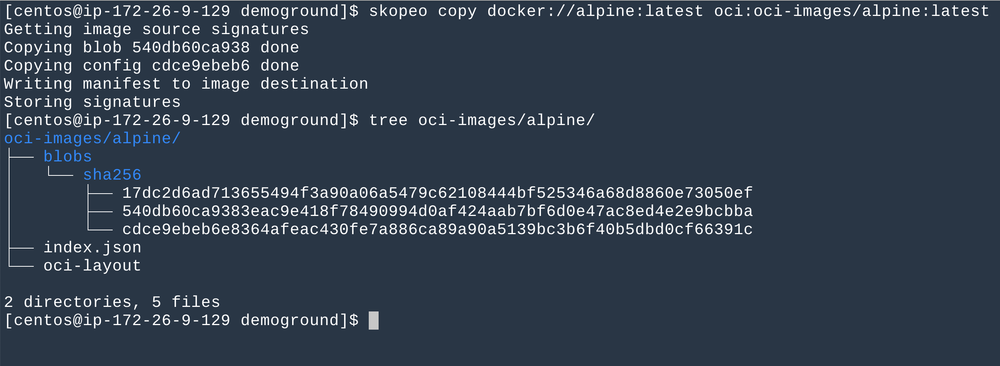
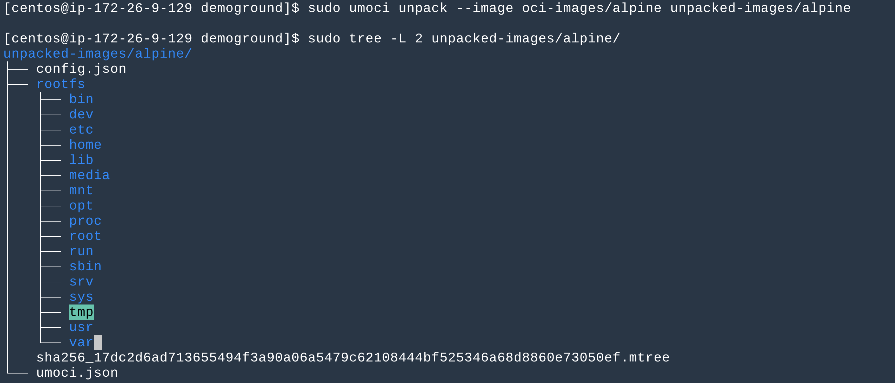

# Create a container without [Moby][moby-dock]

## Before we start
This article is derived from [a great sharing](https://youtu.be/sK5i-N34im8) regarding the underlying secrets of the container world by [Jérôme](https://github.com/jpetazzo) many years ago.  

In this article, we'll go through the demo Jérôme did at the end of that sharing.

Many thanks to Mr. Jérôme Petazzoni.

## Environment Requirements
* A running linux host with kernel header version 5.10+.
  * [btrfs][btrfs-git-link] is a tool to create [COW][cow-storage] file systems. Since it's been [deprecated][btrfs-deprecation] from RHEL, the easy yum-install life is not easy anymore. If you want to install it via the source code, kernel heder version 5.10+ is required, and I believe that having your kernel version matches with the kernel header version is a good idea (maybe not, I don't know).
  * The linux host I picked is from [aws lightsail][aws-lightsail-link] with 4 GB memory, and linux distribution is the [CentOS][centos-link] (seems like RedHat heavily involved in the CNCF timeline we live in, so I picked CentOS).
  * Upgrade the linux kernel is very easy. (All 100+ opened tabs on my web browser agreed with me unanimously) (just kidding, 99+ at most)

* [btrfs][btrfs-git-link]. If you decide to install it via the source code, make sure to follow the `INSTALL` markdown file strictly.
* [skopeo][skopeo-git] and [umoci][umoci-git]. `skopeo` is for image retrieval, coverting (from, and to [OCI][oci-webpage] image foramt). `umoci` is for image tarball unpacking. Without having a docker daemon running in our system, these two tools are our perfect alternatives.

* An extra storage for COW filesystem. I don't want to re-partition the host storage, just asked for an extra storage, and attached to the host. Storage formatting and mounting tutorial can be found [here][btrfs-foramt-mount]

* Last but not least, some useful commands can help you observe the entire lifecycle of the namespaces.
  * `lsns` can list all the namespaces with thier init PIDs
  * `nsenter` allows you to jump into different namespaces.

## Step by Step Breakdown
1. `mount --make-rprivate /`
   > In short, this line will prevent our container file system from bleeding out.  

   > In depth, this is about [mount propagation][mount-propagation]. According to this [answer][rprivate-implication], mount propagation is default off for the kernel, but `systemd` automatically remounts all mount points as **MS_SHARED** on system startup so that `nspawn` and the container tools work out of the box. We turn it back off for our convenience. This change will be lost upon reboot.  
   
   PS. The code mentioned in that answer is moved to [here][systemd-mount-setup].  
     
   Now, move to your btrfs mountpoint. In this demo, it's `/btrfs-data/`
2. `mkdir -p images containers oci-images unpacked-images`
   > `skopeo` will retrive a docker image (`alpine` in this demo), convert & save it as oci format to the `oci-images` directory.
   > `umoci` will upack the oci image tarballs into `unpacked-images` directory. Then we will copy the `rootfs` of our unpacked image into `images` directory. As a result, the `images` directory actullay stores the flattened `rootfs` a container engine should see while starting a container.

3. `skopeo copy docker://alpine:latest oci:oci-images/alpine:latest`
   > This command will write the alpine image in oci format to the `oci-images` directory.
   > 

4. `sudo umoci unpack --image oci-images/alpine unpacked-images/alpine`
   > This command will unpack the oci image into two major parts: the `rootfs` and the `config.json`.
   > `rootfs` will be the fs of your container, and the `config.json` contains all the magic specs your container engine needs to start a container.
   > Since we are the magician that doing the tricks today, the `rootfs` is all we need. But please make sure to take a loot at the `config.json` file, very imformative.
   > 

5. `btrfs subvol create images/alpine`
   > [COW][cow-storage] file system is crucial to containers. Jérôme's another [talk][docker-storage-driver-talk] explained it in depth.
   > This command creates a subvolume under `images/alpine`

6. `cp -r unpacked-images/alpine/rootfs/* images/alpine`
   > Copy the `rootfs` to the image directory.

7. `btrfs subvol snapshot images/apline/ containers/tupperware`
   > Crete a snapshot for the image file system.  
   
   > Every single time, when you start a container from an image, you actually create a mutatble snapshot of the image, and use this snapshot as your container's file system.  
   > Why?  
   > Let's consider a case, for some unkown reasons, you are insanely running 1000 mysql containers on your poor Linux host. Since most of the files in those containers are unchanged throughout the entire container lifecycle, as COW snapshots, no copy happened, and all such unchanged files are still pointing to the same original files in your image. Result? Huge disk space save.  
   > On the other hand, even if you are rich enough to buy extra storages just for witness thousands of identical files. Copying those files to your containers takes time. As a result, you might need to wait for a long time after exected `docker run` command for your container to be ready.

8. `touch containers/tupperware/THIS_IS_TUPPERWAAAARE`
   > Great, we have our own snapshot of the `rootfs`, let's touch it.

9. `chroot containers/tupperware/ sh`
   > Change the root dir to our container's rootfs, have a peek.

10. `ctrl + d` Back to the host fs  
    `unshare --mount --uts --ipc --net --pid --fork bash`
    > This command creates new namespaces.  
    > **pid** namespace creation is a little bit more complicated than the rest. Make sure to have `--fork` while creating a new **PID** namespace. It ensures that the executed command is performed in a child process that (being the first process in the namespace) has PID 1. Otherwise, you'll see an error message similar to **_fork: Cannot allocate memory_**. [Here][unshare-fork] is a more detailed demonstration.  
    > Actually, we missed another flag `--mount-proc` for our **pid** namespace creation, and will need to do it afterwards, the reason why both `--fork` and `--mount-proc` are needed can be found [here][unshare-pid-ns].  
    > [Here][unshare-mount-proc-failed] is also another example can help you understand the **pid** userspace creation better.

11. `hostname tupperware`
    > Set up the container's hostname, nothing special.

12. `exec bash`
    > You are in your tupperware container now, but not a completed container, you only have your own namespaces setup, but not yet well isolated. For example, by running `ps`, you can see only your processes, but the pid is not pid 1. Because you are still in the `/proc` of the system, and having the system view of your namespaced processes. We will fix this later

13. Now, `pivot_root`.  
    ```
    cd containers/tupperware.
    mkdir oldroot
    pivot_root . oldroot/
    ```
    > At step 9, we used `chroot` to take a quick look at our container's `rootfs`, but it's not sufficient. The chroot utility only changes the root for the program, (`sh` in our case) from which it is called – all existing processes and programs started from another shell use the original root.  
    > On the other hand, The `pivot_root` utility exchanges the current root filesystem with a new root filesystem.  
    > > You may encounter an error says **Invalid argument**. According to Jérôme, to make `pivot_root` work properly, you need to have the new root be close the the top level of the file system. So, following commands will do the job.  
    > > `mount --bind /btrfs-data/containers/tupperware/ /btrfs-data/containers/tupperware/`  
    > > This command converts your directory into a mount  
    > > `mount --move /btrfs-data/containers/ /btrfs-data/`  
    > > Move the mount few levels up. Then exec your `pivot_root` command again.
    
14. `mount -t proc none /proc`
    > mount a proc type pseudo filesystem to your `/proc`  
    > This is equivalent to having `--mount-proc` in our `unshare` command above. Now the `ps` command can work properly.

15. `mount` command now can still see the mounts in your host. Use `umount -a` to do the cleanup, the `oldroot` removal is a little bit tricky, `umount -l /oldroot/`. Since the `/proc` is also unmounted, `mount -t proc none /proc` to get it back.

16. Networking. TBD


[moby-dock]: https://www.docker.com/blog/docker-project-announces-open-source-a-thon-to-support-whale-and-marine-wildlife-conservation/
[btrfs-deprecation]: https://news.ycombinator.com/item?id=14907771
[btrfs-git-link]: https://github.com/kdave/btrfs-progs/
[cow-storage]: https://en.wikipedia.org/wiki/Copy-on-write#In_computer_storage
[aws-lightsail-link]: https://aws.amazon.com/lightsail/
[centos-link]: https://www.centos.org/
[skopeo-git]: https://github.com/containers/skopeo
[umoci-git]: https://github.com/opencontainers/umoci
[btrfs-foramt-mount]: https://linuxhint.com/create-mount-btrfs-subvolumes/
[oci-webpage]: https://opencontainers.org/
[mount-propagation]: https://medium.com/kokster/kubernetes-mount-propagation-5306c36a4a2d
[rprivate-implication]: https://serverfault.com/questions/868682/implications-of-mount-make-private
[systemd-mount-setup]: https://github.com/systemd/systemd/blob/05576809194754989f88f83c7104341c35944546/src/shared/mount-setup.c#L528
[docker-storage-driver-talk]: https://youtu.be/9oh_M11-foU
[unshare-fork]: https://stackoverflow.com/questions/44666700/unshare-pid-bin-bash-fork-cannot-allocate-memory
[unshare-pid-ns]: https://unix.stackexchange.com/questions/535528/why-unshare-p-does-not-imply-f-and-mount-proc
[unshare-mount-proc-failed]: https://bugzilla.redhat.com/show_bug.cgi?id=1390057